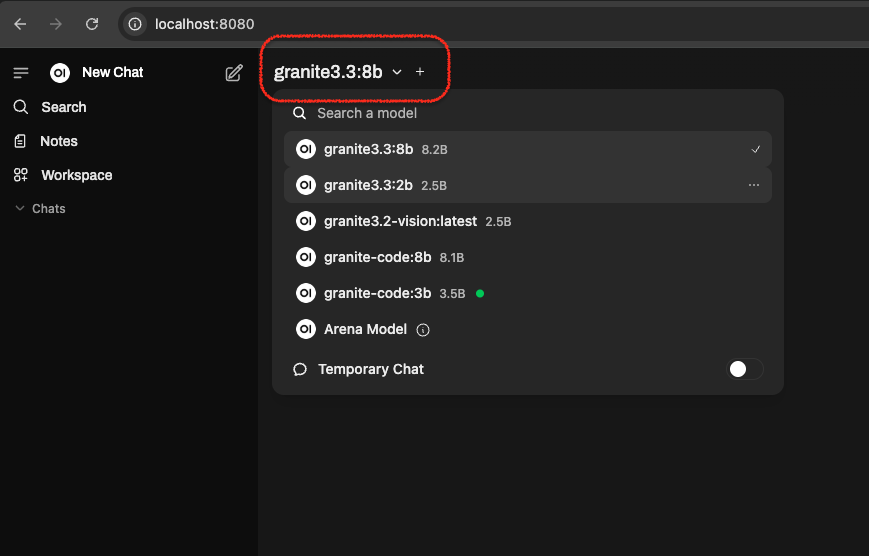
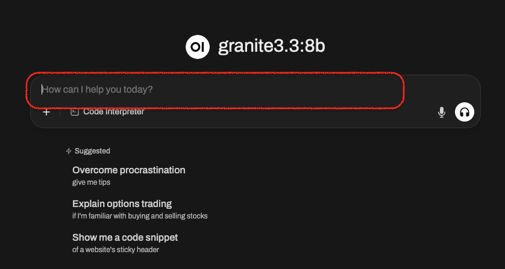
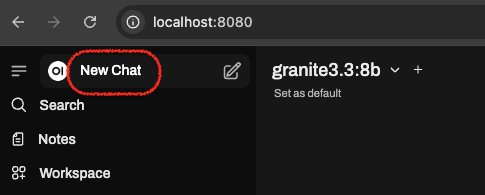

# Using Open-WebUI Interface
Open-WebUI offers a user-friendly web interface for interacting with models, along with other features.
In this lab, you will learn how to use it and explore some of its basic features.

### Preparation
Open-WebUI is a Python package installed in the Python virtual environment you created earlier.
Activate your Python virtual environment if you haven't already:
=== "Windows"
    1.  Activate your Python virtual environment:
    ```shell
    "venv/Scripts/activate.bat"
    ```

=== "MacOS"
    1.  Activate your Python virtual environment:
    ```shell
    source venv/bin/activate
    ```

### Start the Open WebUI
```bash
open-webui serve
```
!!! note
    It would take a while to download some models and some initial configurations for the first time.

### Access the Open WebUI Web Interface
By default, Open WebUI serves on the port 8080. Click the URL below to access the Open WebUI interface:
[http://localhost:8080](http://localhost:8080/)

Click on the `Get Started` button at the bottom of the page and follow the instructions to create the
admin account for the first time. Then you can use the account to log in to the Open WebUI afterwards.


### Select a Model
By default, Open WebUI connects to the Ollama server in your local system. Therefore, it uses the available models
on your Ollama server. Click on the model name on the top left next to the `New Chat` button to switch to a different
model. See the highlight of the image below for more details:


Let's use `granite3.3:8b` for this lab.
```shell
granite3.3:8b
```

### New Chat:
Start a new chat and type the question in the highlighted box:


Here are some example questions you can ask:
```bash
Describe the water cycle in detail, mentioning evaporation, condensation, precipitation, and collection.
```
```bash
Who was Ada Lovelace, and why is she considered a pioneer in computer science?
```
```bash
Why are cats better companions than dogs?
```
```bash
explain your reasoning for why cats and dogs are not inherently better
```

Hit the `<Enter>` key or the up-arrow button to submit the question and wait for the response from the model.

### Context
Within the same context, you can ask a follow-up question or provide additional instructions to
adjust how the model answers your question. For example, give it clear instructions to change the behavior:
```bash
Only answer questions in rhyme. What was domesticated first, a dog or a cat?
```

### Clear the context
Initiate a new chat by clicking on "New Chat" on the top left corner of the page:
